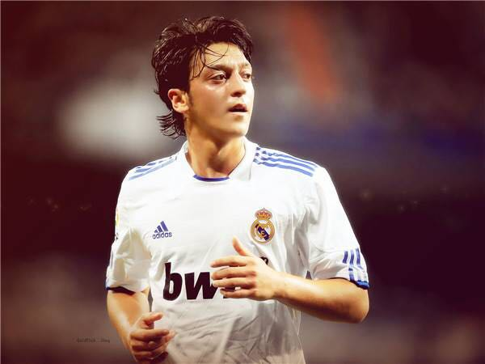
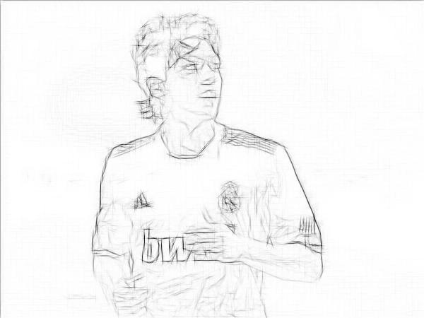

# JavaScript PencilDraw

## 简介
PencilDraw是在论文[Lu C, Xu L, Jia J. Combining sketch and tone for pencil drawing production[C]](http://www.cse.cuhk.edu.hk/leojia/projects/pencilsketch/pencil_drawing.htm)中提出的图像素描风格生成的算法。

去年看到用matlab实现的版本，分别是 [pencil By fumin](https://github.com/fumin/pencil) 和 [PencilDrawing by candycat1992](https://github.com/candycat1992/PencilDrawing)，当时想实现一个python版本用于部署在公司的项目上，然而matlab中的函数实在没能力转成python版本，因此放弃了。

最近看到有同学用python实现了这一算法[pencil-python By duduainankai](https://github.com/duduainankai/pencil-python),但是该程序处理一张照片的时间仍然比较长，毕竟做那么多次卷积时间复杂度摆在那里，所以这么大的计算量部署在服务器承受不住，因此实现了一个JavaScript的版本，希望把计算放在客户端，本来寄希望于能在5秒内处理一张图片，然而实际结果暂时还在10秒以上，后续考虑使用GPU计算，以及优化程序。
实际应用中去除了方向矩阵卷积的乘法，时间降到了3-4秒左右。
## 效果
实现出来的效果和[@duduainankai](https://github.com/duduainankai/pencil-python)的效果几乎一致
目前只实现了获取S图, T图和最终效果图后续补充。

<div align="center">
	
	
</div>
## 运行
``` html
<script type="text/javascript" src="matrix.js"></script>
<script type="text/javascript" src="pencil.js"></script>
<canvas id="test"></canvas>
 <script type="text/javascript">
 		p = new PencilDraw({
 			"url": "58.jpg"
 		});
 		p.draw(document.getElementById("test"));
 </script>
```
[示例程序](http://zengkv.com/PencilDraw/)
## 引用

[1] [Lu C, Xu L, Jia J. Combining sketch and tone for pencil drawing production[C]](<http://www.cse.cuhk.edu.hk/leojia/projects/pencilsketch/pencil_drawing.htm>)

[2] [pencil By fumin](<https://github.com/fumin/pencil>)

[3] [PencilDrawing By cancat1992](<https://github.com/candycat1992/PencilDrawing>)

[4] [素描风格生成](<https://my.oschina.net/Ldpe2G/blog/678156?fromerr=DNOLW1Dg#OSC_h2_11>)

[5] [pencil-python By duduainankai](https://github.com/duduainankai/pencil-python)

[6] [卷积计算公式](<https://wenku.baidu.com/view/85fcca0c83d049649a665873.html>)
